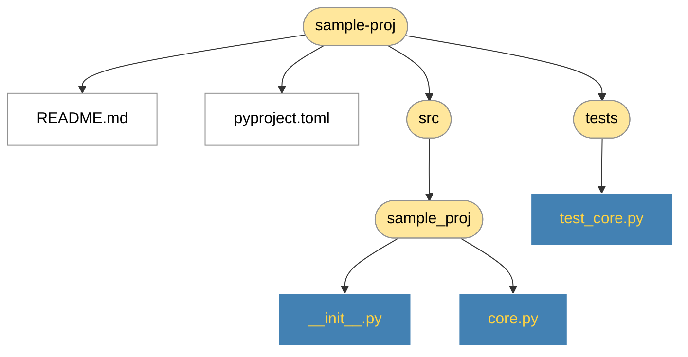

# hexamma

[](https://github.com/janwychowaniak/hexamma/actions/workflows/ci.yml)
[](https://pypi.org/project/hexamma/)
[](https://pypi.org/project/hexamma/)
[](LICENSE)

Render a directory's folder structure as a Graphviz diagram, with files
color-coded by type so the shape of a project is readable at a glance.

- **Folders** — warm yellow fill
- **Python sources** — blue rounded boxes with yellow text
- **Config files** — pale grey note shape
- **Docs** — tinted note shape
- **Hidden entries** — dimmed, connected with dotted edges

## Sample output

Given a typical Python project layout, `hexamma -f mermaid --no-view` produces:



The default output is a PNG opened in your system viewer. Pass `-f svg`,
`-f mermaid`, `-f json`, or any other Graphviz format.

## Requirements

- Python 3.11+
- The Graphviz system binary (`dot` must be on `PATH`) — not needed for
  `-f mermaid` or `-f json`

```bash
# Debian / Ubuntu
sudo apt install graphviz

# macOS
brew install graphviz
```

## Install

### End users

```bash
uvx hexamma path/to/proj    # one-shot, no install
pipx install hexamma        # recommended for repeat use
uv tool install hexamma     # if you already use uv
```

### From source (development)

```bash
git clone https://github.com/janwychowaniak/hexamma
cd hexamma
uv sync                     # creates .venv, installs in editable mode
uv run hexamma --help
```

## Usage

```bash
hexamma                              # current directory → PNG → open viewer
hexamma path/to/proj                 # explicit target
hexamma -d 3                         # cap depth at 3 levels
hexamma -e '*.log' -e build          # add exclude patterns (repeatable)
hexamma --no-default-excludes        # show .git, __pycache__, etc.
hexamma -i '*.py' -i '*.toml'        # show only matched file types
hexamma -f svg -o ~/diagrams/proj    # SVG to a specific path
hexamma -f mermaid --no-view         # Mermaid .mmd, skip viewer
hexamma -f json | jq .               # JSON tree to stdout
hexamma -f json | jq '[.. | strings]' # extract all paths with jq
hexamma --no-view                    # skip viewer (CI / SSH)
hexamma --stats                      # print file + directory counts
hexamma -L                           # follow directory symlinks
hexamma --version                    # show installed version
```

## Output formats

| Flag | Output | Notes |
|---|---|---|
| *(default)* | PNG | Raster via Graphviz; opened in viewer |
| `-f svg` | SVG | Vector via Graphviz |
| `-f pdf` | PDF | Via Graphviz |
| `-f dot` | DOT source | Raw Graphviz input |
| `-f mermaid` | `.mmd` file | Mermaid flowchart; no `dot` binary needed |
| `-f json` | JSON to stdout | Machine-readable tree; pipeable to `jq` |

## Default excludes

To keep diagrams readable, these basenames are excluded by default
(fnmatch globs, matched against basename only):

```
.git  .hg  .svn
__pycache__  *.egg-info  .pytest_cache  .mypy_cache  .ruff_cache  .tox
.venv  venv
node_modules  .next  .nuxt  .svelte-kit  .astro  .turbo
target  .bsp  .metals  .bloop  .scala-build
```

Pass `--no-default-excludes` to disable them entirely, or add your own
patterns with `-e PATTERN` (repeatable, combined with the defaults).

## Customizing the styling

Categorization and colors live in `src/hexamma/styling.py`:

- `Category` — enum of styling categories (`FOLDER`, `HIDDEN`, `SOURCE`, `CONFIG`, `DOC`)
- `SOURCE_EXTS`, `CONFIG_EXTS`, `DOC_EXTS` — extension sets that drive categorization
- `NODE_PALETTE`, `EDGE_PALETTE` — per-category attribute layers applied in a fixed
  order (later layers overwrite earlier ones on colliding keys)

To add a new category: add a `Category` member, an extension set, a palette entry,
update `categorize`, and add the category to the appropriate layer-order tuple.

## Development

```bash
uv sync            # install all deps including dev group
uv run pytest      # run tests (coverage reported automatically)
uv run ruff check  # lint
uv run mypy        # type-check (strict mode)
```

Pre-commit hooks (ruff lint + format) are configured in
`.pre-commit-config.yaml`. Activate with `pre-commit install`.

CI runs lint, format check, mypy, and pytest with a 90% coverage
threshold across Python 3.11, 3.12, and 3.13.

## License

MIT — see [LICENSE](LICENSE).
